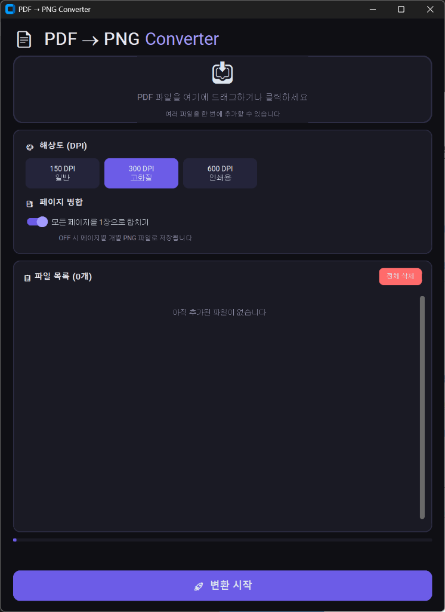

# 📄 PDF ↔ Image Converter

PDF와 이미지를 자유롭게 변환하는 올인원 윈도우 데스크탑 프로그램입니다.

## ✨ 주요 기능

### 📄 PDF → PNG 변환
- **🖱️ 드래그 앤 드롭** — PDF 파일을 창에 끌어다 놓으면 바로 추가
- **📂 다중 파일 지원** — 여러 PDF를 한 번에 변환
- **🎨 DPI 선택** — 150 (일반) / 300 (고화질) / 600 (인쇄용)
- **📑 페이지 병합** — 여러 페이지를 1장 PNG로 합치거나 페이지별 개별 PNG로 분리
- **📊 진행률 표시** — 실시간 변환 진행 상태 확인

### 🖼️ 이미지 → PDF 변환
- **드래그 앤 드롭** — PNG·JPG·JPEG·BMP·WEBP·TIFF·GIF 지원
- **📐 PDF 페이지 크기** — 원본 크기 유지 / A4 / Letter 선택
- **📏 여백 설정** — 없음 / 작게 / 보통 / 크게
- **↕ 페이지 순서 조정** — 파일 목록에서 ▲▼ 버튼으로 순서 변경

### 🔄 PDF 페이지 교체
- **페이지 미리보기** — PDF 불러오면 썸네일 그리드로 모든 페이지 표시
- **선택적 교체** — 원하는 페이지만 클릭하여 이미지로 교체
- **🔄 교체 해제** — 카드의 🔄 버튼으로 개별 교체 취소 가능
- **교체 초기화** — 전체 교체 목록 한 번에 초기화

### 공통
- **🌙 다크 테마** — 눈이 편한 모던 다크 UI

## 📸 스크린샷



> 프로그램 실행 후 PDF 파일을 드래그하거나 클릭하여 추가합니다.

## 🚀 사용법

### EXE 실행 (권장)

1. [Releases](../../releases) 페이지에서 `PDF2PNG_v2.exe`를 다운로드합니다
2. 더블클릭하여 실행합니다
3. 상단 탭에서 원하는 기능을 선택합니다

   | 탭 | 기능 |
   |---|---|
   | 📄 PDF → PNG | PDF를 고품질 PNG 이미지로 변환 |
   | 🖼️ 이미지 → PDF | 이미지 파일들을 하나의 PDF로 묶기 |
   | 🔄 페이지 교체 | PDF 특정 페이지를 이미지로 교체 |

4. 파일을 드래그하거나 클릭하여 추가합니다
5. 옵션 설정 후 변환/저장 버튼을 클릭합니다

> ⚠️ 첫 실행 시 Windows Defender SmartScreen 경고가 나타날 수 있습니다.  
> **"추가 정보" → "실행"** 을 눌러주세요.

### Python으로 실행

```bash
# 의존성 설치
pip install PyMuPDF Pillow customtkinter tkinterdnd2

# 실행
python pdf2png.py
```

## 🛠️ 직접 EXE 빌드

```bash
pip install pyinstaller

python -m PyInstaller PDF2PNG_v2.spec
```

빌드된 EXE는 `dist/PDF2PNG_v2.exe`에 생성됩니다.

## 📋 기술 스택

| 기술 | 용도 |
|---|---|
| **Python 3.10+** | 코어 런타임 |
| **PyMuPDF (fitz)** | PDF 렌더링 / 페이지 교체 |
| **Pillow** | 이미지 합성, 이미지→PDF 변환 |
| **CustomTkinter** | 모던 다크 테마 GUI |
| **TkinterDnD2** | 드래그 앤 드롭 지원 |
| **PyInstaller** | EXE 패키징 |

## 📄 라이선스

MIT License
